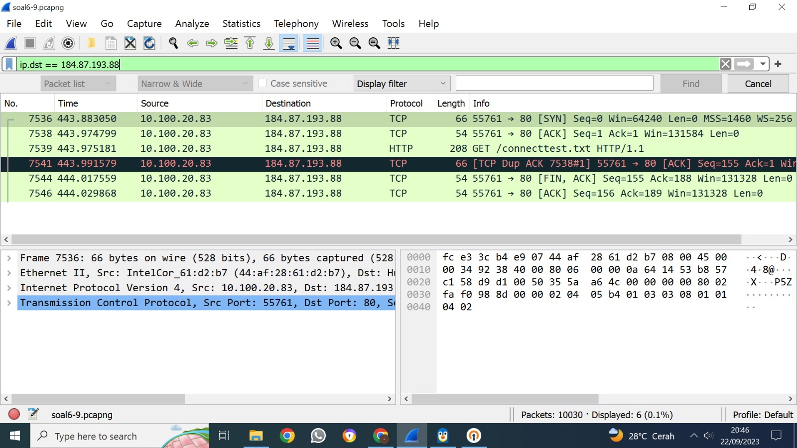

Kelompok  : A03

Nama      : Kalyana Putri Al Kanza

NRP       : 5025211137

## No. 1

### User melakukan berbagai aktivitas dengan menggunakan protokol FTP. Salah satunya adalah mengunggah suatu file.

Hal pertama yang dilakukan adalah menggunakan filter berikut.

```
ftp
```

Lalu mencari packet yang mengunggah suatu file. Di packet 147, ditemukan Request: STOR c75-GrabThePhisher.zip.


### a. Berapakah sequence number (raw) pada packet yang menunjukkan aktivitas tersebut? 

Ditemukan bahwa sequence number (raw) adalah 258040667.


### b. Berapakah acknowledge number (raw) pada packet yang menunjukkan aktivitas tersebut? 

Ditemukan bahwa acknowledge number (raw) adalah 1044861039.


### c. Berapakah sequence number (raw) pada packet yang menunjukkan response dari aktivitas tersebut?

Response dari aktivitas berikut ditemukan di packet 149. Ditemukan bahwa sequence number (raw) adalah 1044861039.


### d. Berapakah acknowledge number (raw) pada packet yang menunjukkan response dari aktivitas tersebut?

Ditemukan bahwa acknowledge number (raw) adalah 258040696.


### Screenshot pengerjaan


## No. 2

### Sebutkan web server yang digunakan pada portal praktikum Jaringan Komputer!

Portal praktikum jaringan komputer adalah 10.21.78.111. Karena itu, untuk mencarinya, digunakan filter berikut.

```
ip.addr == 10.21.78.111
```

Pilih satu paket dan lakukan Follow TCP Stream. Web server yang digunakan tertera di bagian server. Web server yang digunakan pada portal praktikum Jaringan Komputer adalah Gunicorn.


### Screenshot pengerjaan


## No. 3

### Dapin sedang belajar analisis jaringan. Bantulah Dapin untuk mengerjakan soal berikut:

### a. Berapa banyak paket yang tercapture dengan IP source maupun destination address adalah 239.255.255.250 dengan port 3702?

Untuk mencari banyak paket yang tercapture dengan IP source maupun destination address adalah 239.255.255.250 dengan port 3702, digunakan filter berikut.

```
ip.addr == 239.255.255.250 and udp.port == 3702
```

Dengan menghitung total paket yang muncul dengan filter di atas, didapatkan bahwa  banyak paket yang tercapture dengan IP source maupun destination address adalah 239.255.255.250 dengan port 3702 adalah 21 buah.


### b. Protokol layer transport apa yang digunakan?

Seluruh paket dengan IP source maupun destination address adalah 239.255.255.250 dengan port 3702 memiliki protokol layer transport UDP, yang dapat dilihat pada kolom protokol.


### Screenshot pengerjaan


## No. 4

### Berapa nilai checksum yang didapat dari header pada paket nomor 130?

Nilai checksum dapat dilihat di subtree User Datagram Protocol, dan didapatkan bahwa nilai checksum dari header packet 130 adalah 0x18e5.


### Screenshot pengerjaan


## No. 5

### Elshe menemukan suatu file packet capture yang menarik. Bantulah elshe untuk menganalisis file packet capture tersebut.

Di dalam file zip, terdapat file .txt yang membutuhkan password untuk dibuka. Karena itu, dari file .pcapng, dicari info password yang ditemukan di packet no. 14.


Berikut adalah isi dari follow TCP stream.


Hasil decode Base64 dari NWltcGxlUGFzNXdvcmQ= adalah 5implePas5word. Password ini digunakan untuk membuka file .txt. Isinya yaitu perintah untuk membuka pertanyaan lewat instance berikut.

```
nc 10.21.78.111 11111
```

### a. Berapa banyak packet yang berhasil di capture dari file pcap tersebut?

Terdapat 60 packet yang berhasil di capture dari file pcap tersebut.


### b. Port berapakah pada server yang digunakan untuk service SMTP?

Port yang digunakan adalah port 25.


### c. Dari semua alamat IP yang tercapture, IP berapakah yang merupakan public IP?

Yang merupakan public IP adalah 74.53.140.153, seperti yang bisa dilihat di poin 5b.

### Screenshot pengerjaan


## No. 6

### Seorang anak bernama Udin Berteman dengan SlameT yang merupakan seorang penggemar film detektif. sebagai teman yang baik, Ia selalu mengajak slamet untuk bermain valoranT bersama. suatu malam, terjadi sebuah hal yang tak terdUga. ketika udin mereka membuka game tersebut, laptop udin menunjukkan sebuah field text dan Sebuah kode Invalid bertuliskan "server SOURCE ADDRESS 7812 is invalid". ketika ditelusuri di google, hasil pencarian hanya menampilkan a1 e5 u21. jiwa detektif slamet pun bergejolak. bantulah udin dan slamet untuk menemukan solusi kode error tersebut.

### Clue 1: Sepertinya ada yang salah dengan penulisan tersebut secara KBBI. Ada sesuatu yang Besar di depan mata.

### Clue 2: Jenis cipher merupakan substitusi a1z26 Cipher

### Clue 3: Rentang Huruf yang digunakan Huruf A-R, 1-18 dengan Jawaban 6 Huruf.

### Clue 4: SOURCE ADDRESS ADALAH KUNCI SEMUANYA.

Pertama, dicari packet no. 7812. 


Source address dari packet no. 7812 adalah 104.18.14.101. Rentang huruf yang digunakan adalah A-R, 1-18 dengan jawaban 6 huruf. Maka, source address dipecah menjadi sebagai berikut.

10 4 18 14 10 1

Menggunakan a1z26 cipher dan menggunakan huruf kapital (dari clue pertama), didapatkan hasil berikut.

JDRNJA

### Screenshot pengerjaan


## No. 7

### Berapa jumlah packet yang menuju IP 184.87.193.88?

Untuk mencari packet yang menuju IP 184.87.193.88, digunakan filter berikut.

```
ip.dst == 184.87.193.88
```

Didapatkan bahwa jumlah packet yang menuju IP 184.87.193.88 adalah 6.



### Screenshot pengerjaan


## No. 8

### Berikan kueri filter sehingga wireshark hanya mengambil semua protokol paket yang menuju port 80! (Jika terdapat lebih dari 1 port, maka urutkan sesuai dengan abjad)

Digunakan kueri filter berikut untuk mengambil semua protokol packet yang menuju port 80.

```
tcp.dstport == 80 || udp.dstport == 80
```

Berikut adalah contoh hasil pencarian jika menggunakan file .pcapng untuk no. 6-9.


### Screenshot pengerjaan


## No. 9

### Berikan kueri filter sehingga wireshark hanya mengambil paket yang berasal dari alamat 10.51.40.1 tetapi tidak menuju ke alamat 10.39.55.34!

Agar hanya mengambil paket yang berasal dari alamat 10.51.40.1 tetapi tidak menuju ke alamat 10.39.55.34, digunakan filter berikut.

```
ip.src == 10.51.40.1 && ip.dst != 10.39.55.34
```

Berikut adalah contoh hasil pencarian jika menggunakan file .pcapng untuk no. 6-9.


### Screenshot pengerjaan


## No. 10

### Sebutkan kredensial yang benar ketika user mencoba login menggunakan Telnet

Pertama, digunakan filter berikut untuk mencari packet-packet dengan protokol Telnet.

```
telnet
```


Didapatkan kredensial berikut di packet no.227.


Dengan mengabaikan warna biru, didapatkan bahwa jawabannya adalah dhafin:kesayangannyak0k0.

### Screenshot pengerjaan


## Kendala pengerjaan

Karena memakai OpenVPN, jaringan internet saya menjadi buruk dan untuk men-download satu saja file .pcapng bisa mencapai 5 menit. Selain itu, terdapat asdos yang menuduh saya menyontek salah satu teman sesama admin AJK, padahal tidak.
